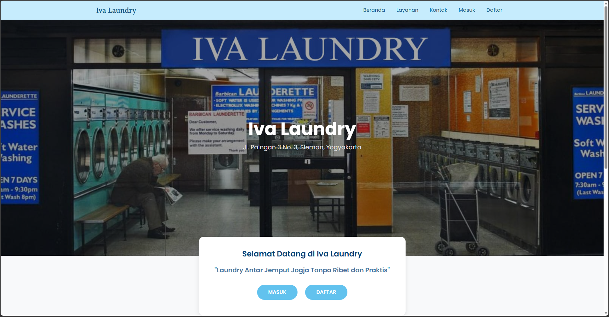
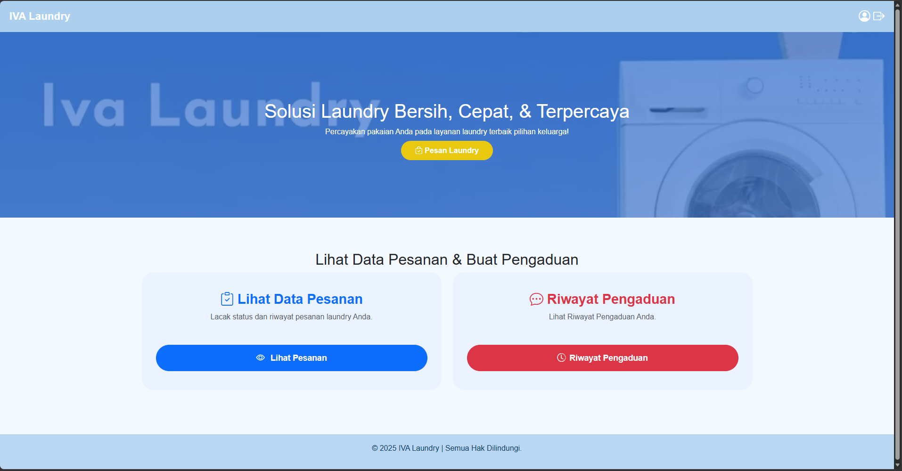
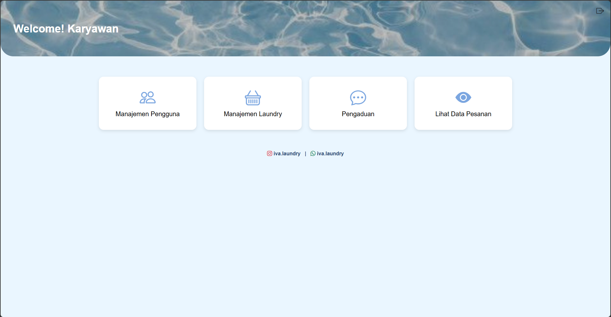

# Laundry Management System

A web-based laundry management application developed as an academic team project.

## My Contributions

- Developed backend functionalities using Laravel
- Assisted in frontend integration
- Performed system testing and validation
- Fixed bugs and resolved integration issues
- Ensured overall system functionality before project delivery

## Features

- User Authentication
- Customer Management
- Order Management
- Transaction Recording
- Laundry Status Tracking

## Tech Stack

- Laravel
- PHP
- MySQL
- Bootstrap
- JavaScript

## Screenshots
- Leanding Page

- Dashboard Pelanggan

- Dashboard Karyawan

## Project Type

Academic Team Project
